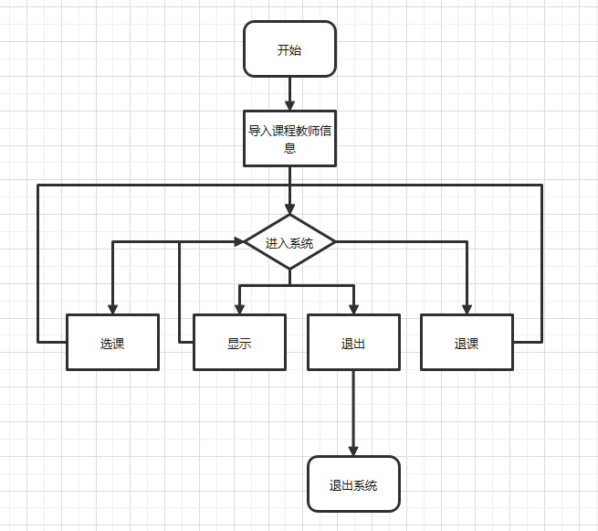
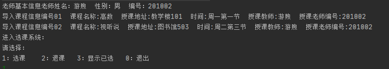
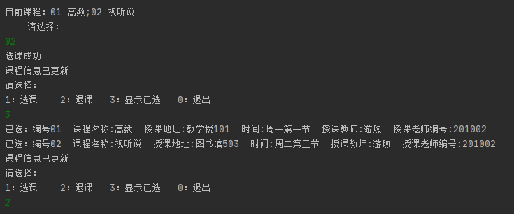
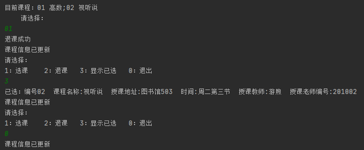

# JAVA第三次实验报告——PC机模拟程序
## 实验目的
---
* 初步了解分析系统需求，从学生选课角度了解系统中的实体及其关系，学会定义类中的属性以及方法；
* 掌握面向对象的类设计方法（属性、方法）；
* 掌握类的继承用法，通过构造方法实例化对象；
* 学会使用super()，用于实例化子类；
* 掌握使用Object根类的toString（）方法,应用在相关对象的信息输出中。
---
## 实验方法
  实验课堂上讲基本的架构基本功能进行实现，课后结合资料与人讨论完善系统，期间对每个重要版本进行保存。尽可能去尝试新的东西，在运用的过程中发现程序的bug或者是程序逻辑上的不完整的地方，尽力去除bug，完善逻辑。解决bug的一般方法是，语法错误则读提示，查相关语法资料，逻辑bug则可以设置断点，或者分模块调试。程序的逻辑不完善则需要重新构思，新模块的实现方法和与老模块的兼容性。
## 代码设计
##### 流程图

## 核心代码
people下的核心代码伪代码展示
```
    //属性
    int bianhao;
    String name;
    String sex;
    //构造方法
    people (int bianhao,String name,String sex){}   
```
Student类定义
```
//属性
 int bianhao;
	String name;
	Course course[] = new Course[20];
	int xuanke[]= new int[20];
  //方法
  void xuanke(int x){
		xuanke[x] = 1;
	}//利用编号数组来确定学生是否选课
	void tuike(int x){}
  public String toString() {}//打印所有信息
  void getcourse(Course cour)//打印课程信息的实现	
  //showall完整代码
  void showall(){
		for(int i=0;i<=19;i++){
			if(xuanke[i] == 1 && course[i] != null){
				System.out.println("已选："+course[i]);
			}
		}
	}
```
Course类定义
```
   //属性
   String bianhao;
       String name;
       String dress;
       String time;
       Teacher teacher;
   //方法
   Course(String bianhao,String name,String dress,String time,Teacher teacher){}
   public String toString() {}
   void show(){}
```
主类定义
```
//定义老师与课程
Teacher you= new Teacher("游煦",201002,"男");
	Course math = new Course("01","高数","教学楼101","周一第一节",you);
	Course english = new Course("02","视听说","图书馆503","周二第三节",you);
    Scanner sc = new Scanner(System.in);
  //导入老师与课程
	Student li = new Student(2019311,"LYL");
	System.out.println("老师基本信息"+you);
	li.getcourse(math);
	li.getcourse(english);
  //进入系统
  while(i != 0){
	    System.out.println("请选择：\n1：选课    2：退课   3：显示已选   0：退出");

		i = sc.nextInt();
		sc.nextLine();     //抛弃剩下内容便于下次调用nextLine
		if(i == 1){
			cls();//清屏方法
			System.out.println("目前课程：01 高数;02 视听说 \n 	请选择：");
			String i1 = sc.nextLine();
			if(i1.equals("01")){
                 li.xuanke(1);
                 System.out.println("选课成功");
			}
			else if(i1.equals("02")){
				li.xuanke(2);
				System.out.println("选课成功");
			}
         else System.out.println("暂无此选课，返回上级");
		}
		else if(i == 2){
			cls();
			System.out.println("目前课程：01 高数;02 视听说 \n 	请选择：");
			String i1 = sc.nextLine();
			if(i1.equals("01")){
				li.tuike(1);
			}
			else if(i1.equals("02")){
				li.tuike(2);
			}
			else System.out.println("暂无此选课,无法退课，返回上级");
		}

        else if(i == 3){
			li.showall();
		}
        System.out.println("课程信息已更新");
    }
```
## 实验结果
---
##### 导入课程资料

##### 进入系统退选课

##### 显示目前选课，退出系统

## 实验感想
---
实验最初只完成了最基本的一些功能，不能称之为系统。在看了同学们的分享之后，完善了系统的逻辑，对整个系统搭建一个大致的结构。虽说整个系统还有很多逻辑不完善的地方，但是目前的程序大体上可以称之为系统。
在修改程序的过程中，遇到的bug不多，主要是在使用数组时，需要对数组进行实例化内存分配。在完善程序的过程中，接触了nextInt等java获取控制版内容的方法，接触了java流的知识。修改实验的过程中，对字符串判断无效，经过筛查，发现了字符串判断分引用型判断和数值型判断。
搜索了网上的相关实验，我觉得我们掌握的东西不够多，课堂上讲解的内容也不够多，需要我们在实验中，在空余时间进一步学习。
随着程序的体量增大，我越发觉得语言是一门实践性的课程，如果只掌握一些理论知识，离编写出程序还是有很大差距的。接下来的实验中，应该更多讲知识运用，尽量尝试新的东西。
知识点：
* java数组创建不能在声明中指定数组元素的个数，需要创建数组，为数组分配内存。
* java多参数传值实质是数组
## 实验相关链接
* nextInt和nextLine的理解 
https://blog.csdn.net/qq_35038153/article/details/79577464?ops_request_misc=%257B%2522request%255Fid%2522%253A%2522160355362019724839255273%2522%252C%2522scm%2522%253A%252220140713.130102334..%2522%257D&request_id=160355362019724839255273&biz_id=0&utm_medium=distribute.pc_search_result.none-task-blog-2~all~first_rank_v2~rank_v28-1-79577464.first_rank_ecpm_v3_pc_rank_v2&utm_term=java+nextint+nextline&spm=1018.2118.3001.4187
* 字符串判断 
https://blog.csdn.net/xingzhiqing/article/details/93177671?ops_request_misc=%257B%2522request%255Fid%2522%253A%2522160355397219724839209481%2522%252C%2522scm%2522%253A%252220140713.130102334..%2522%257D&request_id=160355397219724839209481&biz_id=0&utm_medium=distribute.pc_search_result.none-task-blog-2~all~first_rank_v2~rank_v28-1-93177671.first_rank_ecpm_v3_pc_rank_v2&utm_term=java%E5%AD%97%E7%AC%A6%E4%B8%B2%E5%88%A4%E6%96%AD&spm=1018.2118.3001.4187
* 控制台输入方法
https://blog.csdn.net/idomyway/article/details/82748000?biz_id=102&utm_term=%E6%8E%A5%E5%8F%97%E8%BE%93%E5%85%A5%E7%9A%84%E6%95%B0%E5%AD%97java&utm_medium=distribute.pc_search_result.none-task-blog-2~all~sobaiduweb~default-1-82748000&spm=1018.2118.3001.4187
* 强制类型转换
https://blog.csdn.net/qq_34851243/article/details/91665870?ops_request_misc=%257B%2522request%255Fid%2522%253A%2522160346697319724838536089%2522%252C%2522scm%2522%253A%252220140713.130102334..%2522%257D&request_id=160346697319724838536089&biz_id=0&utm_medium=distribute.pc_search_result.none-task-blog-2~all~first_rank_v2~rank_v28-1-91665870.first_rank_ecpm_v3_pc_rank_v2&utm_term=java%E5%BC%BA%E5%88%B6%E7%B1%BB%E5%9E%8B%E8%BD%AC%E6%8D%A2&spm=1018.2118.3001.4187
